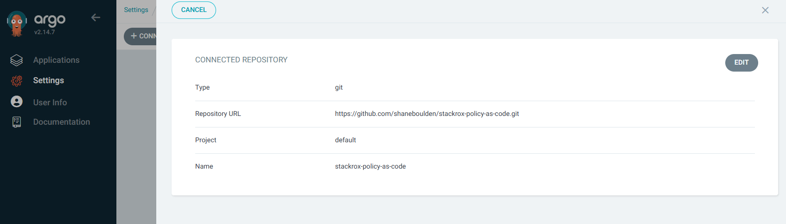
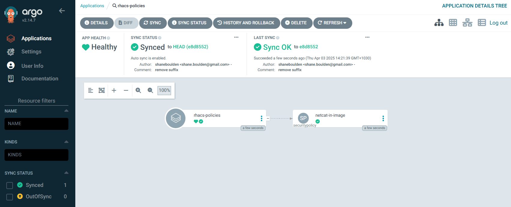
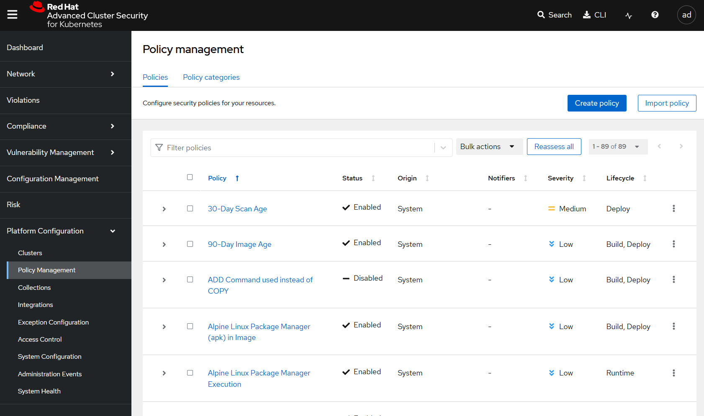
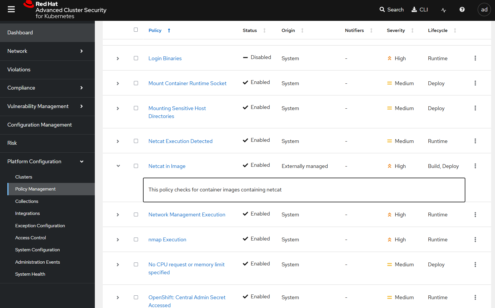
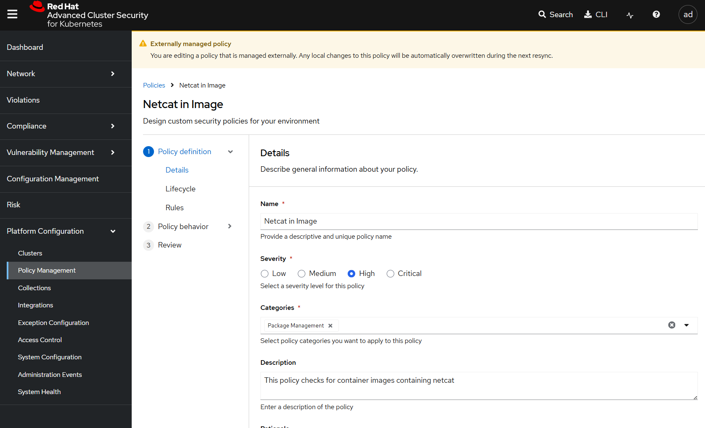

## StackRox policy-as-code demo
A repo containing artifacts to demonstrate Red Hat Advanced Cluster Security for Kubernetes (RHACS) / StackRox policy-as-code workflows

### Pre-requisites
- An OpenShift cluster with Red Hat Advanced Cluster Security for Kubernetes (RHACS) Central and Secured Cluster services deployed
- OpenShift GitOps
- Ansible Automation Platform 2.x

### Setup
Ensure that OpenShift GitOps can make changes in the namespace where RHACS Central is deployed and configured:
```
oc adm policy add-role-to-user admin system:serviceaccount:openshift-gitops:openshift-gitops-argocd-application-controller -n stackrox
```

### Walkthrough
Login to OpenShift GitOps and connect this repository:



Create the GitOps application:
```
oc create -f app.yaml
```
Observe that the application is created and the `netcat-in-image` SecurityPolicy is created.



Navigate to Red Hat Advanced Cluster Security for Kubernetes (RHACS) and access the 'Policy Management' tab:



Find the new 'Netcat in Image' policy, which will be externally managed.



Attempt to edit the policy and show the banner message.


